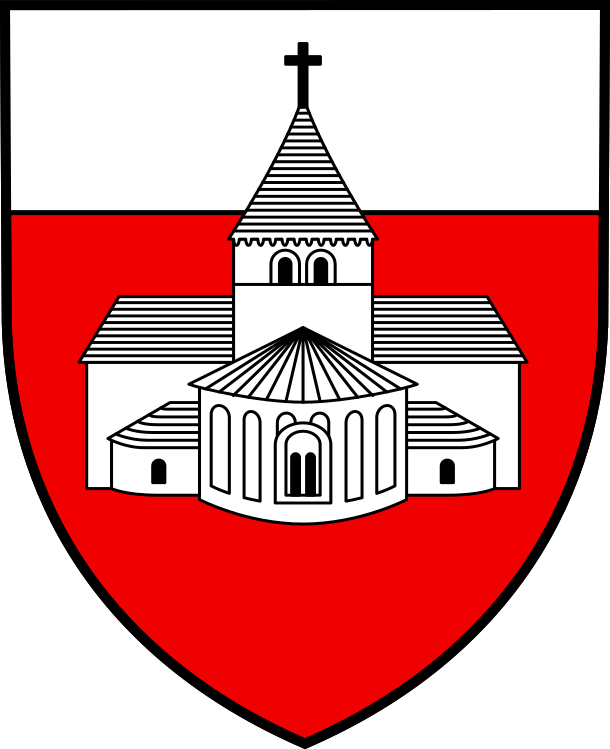

::: {.grid}

::: {.g-col-12 .g-col-sm-4}

```{=html}
<div class="grid" style="--bs-columns: 5; row-gap: 0;">
  <div class="g-col-1 g-col-sm-0"></div>
  <div class="g-col-3 g-col-sm-5">
    <picture>
      }}" alt="Wenyu Liu's Profile Photo">
    </picture>
  </div>
  <div class="g-col-1 g-col-sm-0"></div>
</div>
```

:::


::: {.g-col-12 .g-col-sm-8 style="padding-left: 2rem; padding-top: 1rem;"}

Hello! 😉

I'm Wenyu Liu ( ), a master student in energy at  École Polytechnique Fédérale de Lausanne (EPFL). 

Currently, I am living in  St-Sulpice, Switzerland.

Before 2023, I lived in Xi'an, China, where I completed my bachelor's degree in energy storage at   Xi'an Jiaotong University (XJTU).

I speak Chinese, English and a little French. &ensp; 我说汉语，英语和一点法语。&ensp;Je parle anglais, chinois et un peu français.
:::

:::

<br>

<!-- --- -->
## Education

- **2023 - 2026** : Master in Energy Science and Technology @ [École Polytechnique Fédérale de Lausanne](https://www.epfl.ch/en/)

- **2019 - 2023** : Bachelor in Energy Storage Science and Engineering @ [Xi’an Jiaotong University](https://www.xjtu.edu.cn/)

- **2016 - 2019** : High school education @ Chang'an No.1 High School

## Work Experience

- **02.2025 - 08.2025** : Internship in Power Systems of the Future (100%) @ [Hitachi Energy](https://www.hitachienergy.com/)

- **07.2024 - 09.2024** : Summer Internship in Charging System (100%) @ [SAIC Motor](https://www.saicmotor.com/chinese/)

- **03.2022 - 09.2022** : Internship in Energy Storage Market (40%) @ [China Energy Storage Alliance](https://www.cnesa.org/)